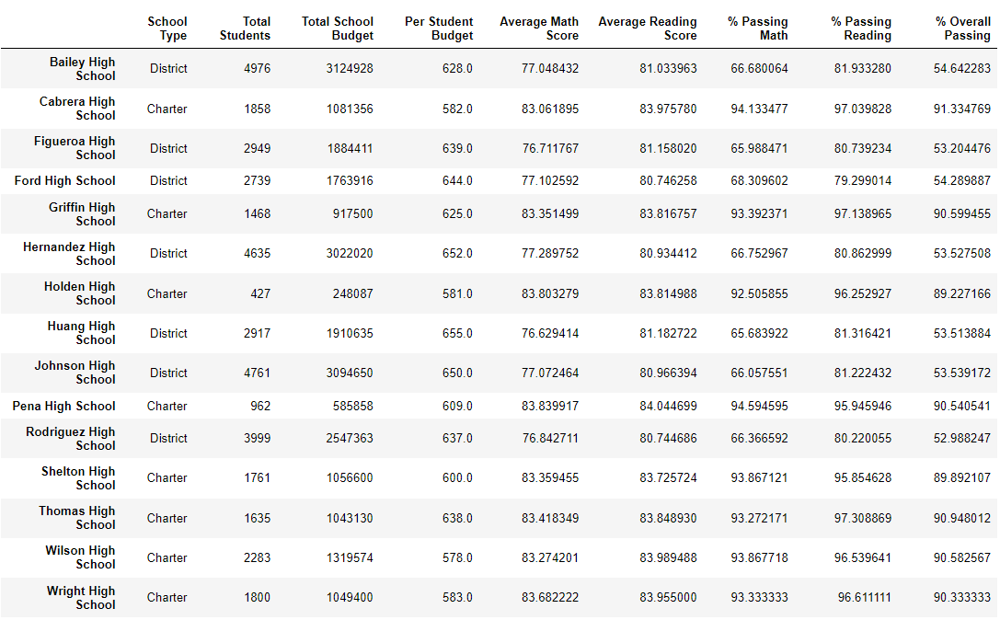

# School_District_Analysis
Perform school district analysis using Anaconda enviroment
## Overview of the school district analysis
Maria, a chief Data Scientist is a incharge of the project assisting school board in making strategic and purposeful decision by analyzing the data for 15 different schools. This project covers funding received towards per school/student and proficiency of each school/student and to get final results on categorizing data as per budget and profroficiency, i will be assisting Maria in this project. Because of the last minute news of acedemic dishonesty of 9th grade students at Thomas High school, we as a team under Maria's instructions has decided to replace 9th grade student data with NaN and refactor rest of the code. This project covers all refcatored and adjusted code to display necessary changes as per school regulatory standards. 
## Purpose of school district analysis
Main purpose of this project is to analysis and assist the school board by presenting data on school funding and student passing output by undergoing necessary changes and displaying changes for Thomas High school along with other 14 schools. 
## Results of school district analysis
- How is the district summary affected?

There is no as such drastic change in the poutput of Analysis A and B, just 9th grade passing scores for Thomas High School got replaced with NaN.
- How is the school summary affected?

% of students at Thomas High School passed in math, reading and overall has dropped down drastically with high numbers after the replacment of 9th grade students data at Thomas with NaN.
- How does replacing the ninth graders’ math and reading scores affect Thomas High School’s performance relative to the other schools?

After the replacment and drastic down in performance of students at Thomas High School, Thomas High school has lost his place from Top 5 High school category. 
- How does replacing the ninth-grade scores affect the following:
     - Math and reading scores by grade
    
    
    
    
    - Scores by school spending
    From file in repository i.e. PyCitySchools_Challenge.ipynb percentage score of Math, reading and overall passing for scores by school spending has went down from 73, 84 & 63% to 67, 77 & 56% respectively.
    - Scores by school size
    
    Schools with student size between 1000 to 2000 students i.e. medium school size has shown a downward slop in math, reading and overall passing %. 
    - Scores by school type
    
    
    From analysis A to analysis B specially in charter district, % of students passing in math, reading and math & reading has resulted in decrease in % to 90.3%, 93% and 87% respectively.
## Summary of four changes in the updated school district analysis after reading and math scores for the ninth grade at Thomas High School have been replaced with NaNs.
- Districy level changes from analysis A to B were minimal.
- School level analysis has hit only to Thomas High School but others had steady data.
- Ranking of Thomas High school changed from Top 5 high schools. 
- Charter school type results has shown around 5 to 7 % change in passing data because of changes in Thomas High school. 
